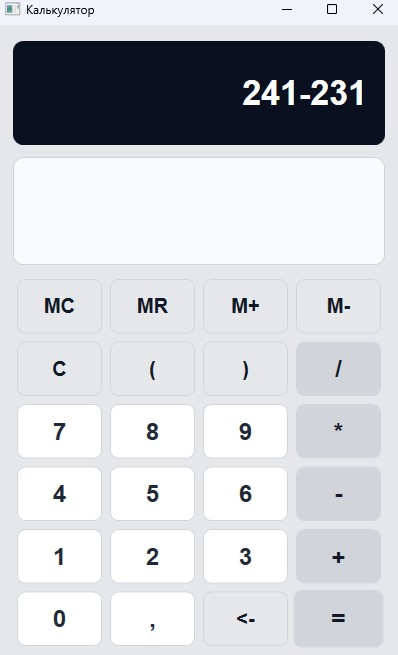
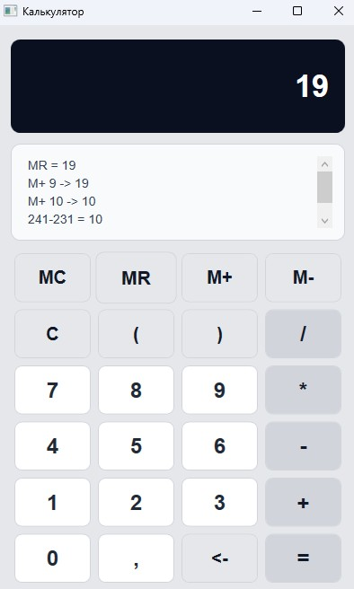
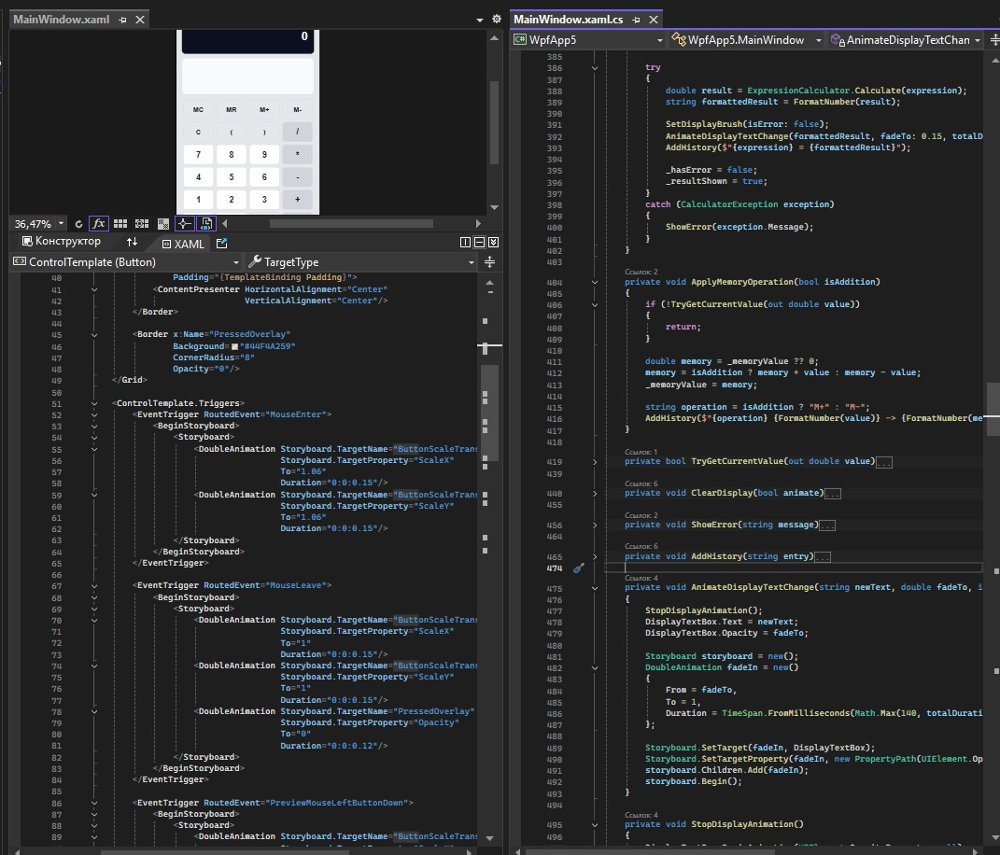

# Лабораторная работа 6. Калькулятор с анимациями

Задание: создать WPF-калькулятор с арифметическими операциями и анимационными эффектами интерфейса.

Интерфейс расположен в `WpfApp5/MainWindow.xaml`. В окне размещены дисплей, журнал вычислений и сетка кнопок для цифр, операций, очистки, вычисления результата и работы с памятью. Кнопки `MC`, `MR`, `M+`, `M-` позволяют очищать память, читать сохраненное значение, прибавлять текущее значение к памяти и вычитать его.

Вычисления выполняются в `WpfApp5/MainWindow.xaml.cs`. Метод `EvaluateCurrentExpression` вызывает `ExpressionCalculator.Calculate`, а затем выводит результат и добавляет запись в историю. Команды памяти обрабатываются методами `MemoryClearButton_Click`, `MemoryRecallButton_Click`, `MemoryAddButton_Click`, `MemorySubtractButton_Click`; общая логика изменения памяти вынесена в `ApplyMemoryOperation`.

Анимации заданы в шаблоне кнопки через `Storyboard` и `DoubleAnimation`. При наведении кнопка плавно масштабируется, при нажатии появляется наложение `PressedOverlay`. Изменение текста дисплея дополнительно анимируется методом `AnimateDisplayTextChange`, который применяет эффект появления через прозрачность.

Снимок 1: общий вид калькулятора с кнопками памяти.

Снимок 2: сценарий `M+` и `MR` с отображением результата или записи в истории.

Снимок 3: фрагменты `MainWindow.xaml` с `Storyboard` и `MainWindow.xaml.cs` с `ApplyMemoryOperation` и `AnimateDisplayTextChange`.